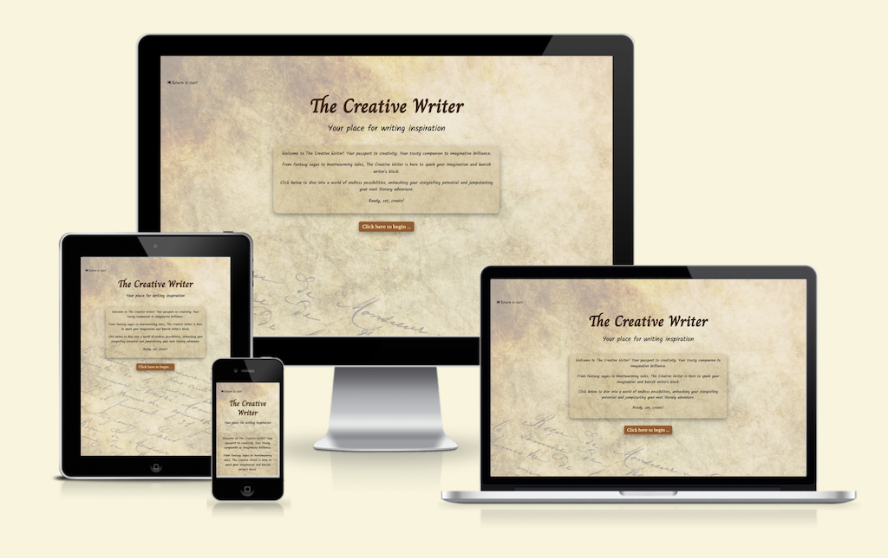

# The Creative Writer

The website completed and presented for Milestone Project 2 is intended to be a tool for inspiring writers in their practice. 
It has been designed and developed using a mobile-first approach, and is accessible and responsive across a range of devices.

<p align="center">
    
</p>

[Visit the deployed site](https://mikiburgess.github.io/MP2-Creative-Writer/)


- - -

## Table of Contents

- [Introduction](#Introduction)
- [User Experience (UX)](#User-Experience-(UX))
  - [Project Goals](#Project-Goals)
  - [Strategy](#Strategy)
  - [Scope](#Scope)
  - [Structure](#Structure)
  - [Skeleton](#Skeleton)
  - [Surface](#Surface)
- Site Development
- Site Features
  - Current Features
  - Future Features
- Guide to Deployment and Development
- Project Reflection
- Credits

- - -


## Introduction

This repository and the associated deployed website comprise my submission for the Diploma in Web Development, Milestone Project 2. 

- - -

## User Experience (UX)


...

### Project Goals
The primary goal of this project is to design, develop and deploy a website to inspire and support writers, specifically those with an interest in creative (fiction) writing.

### Strategy
<!-- What are we aiming to achieve, and for whom? -->

The target audience for this site is for anyone looking for ideas to inspire their creative writing. This ranges from individuals wishing to write a story but don't know where to start, a writer looking for a writing exercise to develop their skills, to an educator looking for a tool to help engage their students in creative writing.
As the focus of this site is supporting writers, the site also needs to be intuitive to use (so they can get writing quickly), and uncluttered (so they can write without distractions, such as adverts and animations).


### Scope
<!-- What features do we want to include in the design? What's on the table, and whats off (for now)? -->

This creative writing prompt generator aims to provide cognitive exercise for the creative writer, inspire the short story writer, and support the daily meditative and free writer. As well as being used by individuals, it's also intended that this tool be a free writing support resource for educators in an upper-high school and/or collage environment.
The needs of these users have been identified and described in the following set of user stories.


#### User Stories
* As a meditative / free writer I want to ...
  1. be given a starting point and context for my writing
  2. have a clear, minimalist space where I can concentrate solely on writing without distraction of formatting and other tools
  3. be able to retain a record of my writing in case I want to reflect back on it in future

* As a short story writer I want to ...
  1. get random inspiration for my writing
  2. tailor the writing inspiration based on my current mood
  3. be able to retain a copy of my writing for my portfolio

* As a creative writer I want to ...
  1. get random inspiration for my writing
  2. the ability to tailor the writing prompt
  3. be able to retain a copy of my writing for my portfolio  

* As a teacher I want ...
  1. a free to use resource that can be used in the classroom, on any available computing devices (e.g., laptops, tablets, mobile devices, etc).
  2. a tool that can be used to inspire my students in creative writing exercises

* As a new user I want to ...
  1. have an intuitive, simple-to-use, interface
  2. be able to use the site quickly and easily


### Structure
<!-- How is the information structured, and is it logically grouped? -->


### Skeleton
<!-- How the information should be implemented, and how the user will navigate through the info/features -->

#### Wireframes


### Surface
<!-- What the product will actually look like, colors, typography, images, design elements, etc -->

#### Background Image
A background image was selected to replicate the feeling of an old handwritten notebook, supporting the theme of creative writing. Pixabay was used to identify a number of candidate background images.

<p align="center">
    
</p>


The final decision was made by selecting an image that would be unobtrusive and usable across multiple devices (i.e., suitable for a responsive site). 

#### Color Palette
The color palette for the site was created using [Coolors](https://coolors.co/) to be complementary to the selected background image.

<p align="center">
    
</p>

These colors were defined as names variables in the stylesheet to support color consistency across the site and improve code readability:

```javascript
:root {
    --palette-pale-opaque: rgba(255, 230, 168, 0.8);
    --palette-pale: #ffe6a8;
    --palette-chocolate: #99582A;
    --palette-dark: #432818;
    --palette-caramel: #BB9457;
    --palette-caramel-opaque: rgba(186, 149, 89, 0.25);
    --palette-rich: #6F1D1B;
}
```

#### Typography
To maintain the style of a handwritten notebook, two cursive fonts were selected for use throughout the site. These were supplemented by a serif font for supplementary text (primarily site buttons).

The following fonts were selected for use across the site:
- [Charm](https://fonts.google.com/specimen/Charm) - a grand, cursive font the main site header (`<h1>`), and 'restart' button.
- [Kalam](https://fonts.google.com/specimen/Kalam)  - a cursive font for most text on the site, including the user writing area (`<textarea>`)
- [Libre Baskerville](https://fonts.google.com/specimen/Libre+Baskerville) - a crisp serif font for other site headings, site buttons and the site footer.


#### Accessibility


- - -

## Site Development