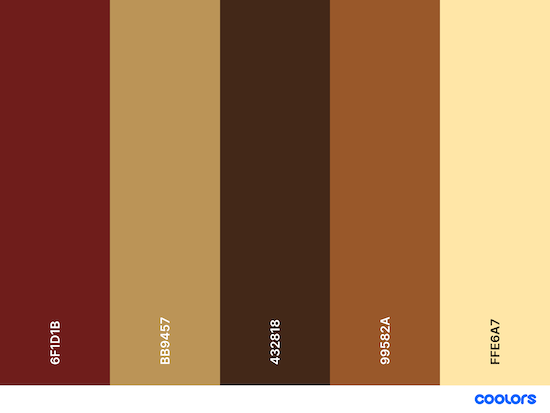

# The Creative Writer

The website completed and presented for Milestone Project 2 is intended to be a tool for inspiring writers in their practice. 
It has been designed and developed using a mobile-first approach, and is accessible and responsive across a range of devices.

<p align="center">
    
</p>

[Visit the deployed site](https://mikiburgess.github.io/MP2-Creative-Writer/)


- - -

## Table of Contents

- [Introduction](#Introduction)
- [User Experience (UX)](#User-Experience-(UX))
  - [Project Goals](#Project-Goals)
  - [Strategy](#Strategy)
  - [Scope](#Scope)
  - [Structure](#Structure)
  - [Skeleton](#Skeleton)
  - [Surface](#Surface)
- Site Development
- Site Features
  - Current Features
  - Future Features
- Guide to Deployment and Development
- Project Reflection
- Credits

- - -


## Introduction

This repository and the associated deployed website comprise my submission for the Diploma in Web Development, Milestone Project 2. 

<kbd>[Return to ToC](#Table-of-Contents)</kbd>
- - -

## User Experience (UX)
This site is targeted at individuals who are looking for writing prompts to inspire their creative writing. The target users and approach to designing and developing this site is discussed below.


### Project Goals
The primary goal of this project is to design, develop and deploy a website to inspire and support writers, specifically those with an interest in creative (fiction) writing.

### Strategy
<!-- What are we aiming to achieve, and for whom? -->
The target audience for this site is for anyone looking for ideas to inspire their creative writing. This ranges from individuals wishing to write a story but don't know where to start, writers looking for writing exercises to develop their skills, to educators looking for a tool to help engage their students in creative writing.
As the focus of this site is supporting writers, the site also needs to be intuitive to use (so they can get writing quickly), and uncluttered (so they can write without distractions, such as adverts and animations).


### Scope
<!-- What features do we want to include in the design? What's on the table, and whats off (for now)? -->
This creative writing prompt generator aims to provide cognitive exercise for the creative writer, inspire the short story writer, and support the daily meditative and free writer. As well as being used by individuals, it's also intended that this tool be a free writing support resource for educators in an upper-high school and/or collage environment.
The needs of these users have been identified and described in the following set of user stories.


#### User Stories
The four identified users for this site are listed below, along with their specific needs:

* As a meditative / free writer I want to ...
  1. be given a starting point and context for my writing
  2. have a clear, minimalist space where I can concentrate solely on writing without distraction of formatting and other tools
  3. be able to retain a record of my writing in case I want to reflect back on it in future

* As a short story writer I want to ...
  1. get random inspiration for my writing
  2. tailor the writing inspiration based on my current mood
  3. be able to retain a copy of my writing for my portfolio

* As a creative writer I want to ...
  1. get random inspiration for my writing
  2. the ability to tailor the writing prompt
  3. be able to retain a copy of my writing for my portfolio  

* As a teacher I want ...
  1. a free to use resource that can be used in the classroom, on any available computing devices (e.g., laptops, tablets, mobile devices, etc).
  2. a tool that can be used to inspire my students in creative writing exercises


### Structure
<!-- How is the information structured, and is it logically grouped? -->
This site will comprise a single HTML page, but with dynamic content that will be constructed and displayed as the site visitor uses the site features. This dynamic behaviour will be developed using JavaScript.

In order to be able to generate a writing prompt, the number of prompt items needs to be decided and a suitable set of data created for each.
The data for all writing prompt elements will be stored in JavaScript objects - one per writing prompt element: 

```javascript
{name: "", icon: "fa-solid ", emojisym: "", genre: []}
```
- `name` => the displayed text for the writing prompt element (eg, for the 'villain' prompt element the name may be 'vampire').
 - `icon` => reference to a 'fontawesome' icon used to represent this element (eg, an icon for a 'vampire'). [*key included ready for future site development*]
 - `emojisym` => symbol for the emoji that can be used to represent this element (eg, the 'vampire' emoji). [*key included ready for future site development*]
 - `genre[]` => array containing all genres for which this element is applicable (eg, for 'vampire' this would include 'Scary' and 'Fantasy').

This approach was taken as in future this could be easily developed into a JSON or SQL data storage facility.

Initially four genres and two 'flexible' options will be stored in an array:
```javascript
const genres = ["General", "Historical", "Fantasy", "Adventure", "Scary"];
```
This decision was made to again support future development by expanding the available genres.\
\
\
The backed file structure was implemented according to the following design:


    - 📰 index.html           <-- single, dynamically constructed page
    - 📂 assets
        - 📂 css
            - 📰 style.css    <-- CSS stylesheet 
        - 📂 images           <-- folder containing all site images 
        - 📂 scripts
            - 📰 data.js      <-- Javascript - containing all site data
            - 📰 script.js    <-- JavaScript - code for site construction and interaction
            - 📰 sendMail.js  <-- JavaScript - code for sending email using EmailJS
*Figure 1: Design of site file structure*


### Skeleton
<!-- How the information should be implemented, and how the user will navigate through the info/features -->
The site will comprise a single page, with content dynamically constructed as the user navigates through the creative writing process using site buttons to control progress between each stage.

The activity flow through the site will be as follows:
```
 Starting point => Stage 0 - Welcome: Introduction to the site.
 leads to => Stage 1 - Genre Selection: Set of options from which user can select.
 leads to => Stage 2 - Writing Prompt Generation: View and edit a the randomly generated writing prompt for the selected genre.
 leads to => Stage 3 - Writing Area: Space for writing a story based on the generated writing prompt.
 leads to => prompt and writing being emailed to site user
```

#### Wireframes
A set of wireframes were developed to guide the site build. For each stage in the application flow a wireframe was designed for the following Bootstrap breakpoints: X-Small, Small, Medium, Large, X-Large. These were created to ensure responsiveness across devices/viewports.

In addition, two further sets of wireframes were created to support site implementation. These latter two focussed only on the small (mobile phone) device size, supporting the mobile-first approach to design.\
\
\

*Figure 2: Stage 0 - Welcome to the Site*


*Figure 3: Stage 1 - Genre Selection*


*Figure 4: Stage 2 - Writing Prompt Generation and Display*


*Figure 5: Stage 3 - Writing Area*


*Figure 6: Site structure and elements (classes & ids)*


*Figure 7: Code elements (site functionality & interactivity)*\
\
\
Minor adjustments were made to the final design based on reflection during the development stage. However these were minimal. 


### Surface
<!-- What the product will actually look like, colors, typography, images, design elements, etc -->
The surface design decisions of the site were driven by the idea of writing, and specifically writing in a book.

#### Background Image
A background image was selected to replicate the feeling of an old handwritten notebook, supporting the theme of creative writing. Pixabay was used to identify a number of candidate background images.

<p align="center">
    
</p>

*Figure 8: Candidate site background images*

The final decision was made by selecting an image that would be unobtrusive and usable across multiple devices (i.e., suitable for a responsive site). 

#### Color Palette
The color palette for the site was created using [Coolors](https://coolors.co/) to be complementary to the selected background image.

<p align="center">
    
</p>

*Figure 9: Site color palette*

These colors were defined as names variables in the stylesheet to support color consistency across the site and improve code readability:

```javascript
:root {
    --palette-pale-opaque: rgba(255, 230, 168, 0.8);
    --palette-pale: #ffe6a8;
    --palette-chocolate: #99582A;
    --palette-dark: #432818;
    --palette-caramel: #BB9457;
    --palette-caramel-opaque: rgba(186, 149, 89, 0.25);
    --palette-rich: #6F1D1B;
}
```

#### Typography
To maintain the style of a handwritten notebook, two cursive fonts were selected for use throughout the site. These were supplemented by a serif font for supplementary text (primarily site buttons).

The following fonts were selected for use across the site:
- [Charm](https://fonts.google.com/specimen/Charm) - a grand, cursive font the main site header (`<h1>`), and 'restart' button.
- [Kalam](https://fonts.google.com/specimen/Kalam)  - a cursive font for most text on the site, including the user writing area (`<textarea>`)
- [Libre Baskerville](https://fonts.google.com/specimen/Libre+Baskerville) - a crisp serif font for other site headings, site buttons and the site footer.

#### Site Images
A selection of royalty-free images were chosen from [Pixabay](https://pixabay.com/) to represent each of the four genres, and the two additional options. The focus again was on drawings rather than photographs, considering the types of sketches a writer may include in their notebook.

#### Accessibility
Site accessibility was considered throughout the design, development and testing process. This was guided by [W3C ARIA guidelines](https://www.w3.org/WAI/ARIA/apg/) and [MDN](https://developer.mozilla.org/en-US/docs/Web/Accessibility/ARIA).


<kbd>[Return to ToC](#Table-of-Contents)</kbd>
- - -

## Site Functionality
The Creative Writer is a single page site that is dynamically constructed according to user interaction. The following presents a walkthrough of it's current features.

A number of further developments are planned which will improve functionality, accessibility and the overall user experience (UX). These are discussed later under [Future Features](#Future-Features).

(*Note - Figure labels have been omitted from this section for clarity.*)


### Stage 0: Welcome to the Site
The current start page welcomes site visitors. The user then clicks the button to begin.

<p align="center">
    
</p>

<!-- *Figure 10: Current start page (stage 0)* -->

**Stage 1:** The user is presented with a number of story themes, or 'genres', from which they can select. 
When selected the 'chosen genre' text will update to tell the user which genre they have currently chosen.

<p align="center">
    
</p>

<!-- *Figure 11: Genre selection (stage 1)* -->

**Stage 1:** Once ready the user clicks the button to confirm their chosen genre. This selection will then focus the type of writing prompt to be generated at the next stage.

<p align="center">
    
</p>

<!-- *Figure 12: Confirm genre selection (stage 1)* -->

**Stage 2:** A writing prompt is randomly generated according to the user selected genre. 
If the user is unhappy and wants a different set of elements, clicking the *"I'm not happy"* button will generate a new set of writing prompt elements.
If the user wishes to modify any single element, clicking the associated refresh icon (button) will randomly select another (leaving the others unchanged). 
Once happy, the user can click the *"I'm happy"* button, which takes them to the next stage.

<p align="center">
    
</p>

<!-- *Figure 13: Generated writing prompt (stage 2)* -->

**Stage 3:** The final page of the site displays the final, complete writing prompt to the user, who can then use the text area to compose their story/prose. This area include no formatting or spell checking tools to support the free, stream-of-consciousness writing style to encourage the creative writer explore their imagination.

<p align="center">
    
</p>

<!-- *Figure 14: Writing area (stage 3)* -->

**Finishing Up:** When the user has completed their writing exercise, of simply wishes to save the writing prompt for use later, entering their email in the space provided and clicking the *"Send email"* button will sent the prompt and any text they have written directly to their inbox.

<p align="center">
    
</p>

<!-- *Figure 15: Sending an email* -->

For example, based on the prompt and text written in the above example the user will receive the following email:

<p align="center">
    
</p>

<!-- *Figure 16: Email sent from 'The Creative Writer'* -->


<kbd>[Return to ToC](#Table-of-Contents)</kbd>
---


## Site Development
### Development Tools
- UI Wireframes were created using [Balsamiq](https://balsamiq.com/)
- Code was be developed locally using [Visual Studio Code](https://code.visualstudio.com/)
- [Chrome DevTools](https://developer.chrome.com/docs/devtools/), as embedded within Google's Chrome browser, were used to support the development. In particular, the code inspector, [Lighthouse](https://developer.chrome.com/docs/lighthouse/), and the responsive design checker (for checking site responsiveness across all viewports)
- Completed site was deployed using [GitHub Pages](https://pages.github.com/).

### Version Control
Versioning was managed locally using [Git](https://git-scm.com/). 

Code was committed regularly during the development process, with each commit being labelled according to the work type.

*Table 1: Summary of Git Commit Types*

| *TYPE* | *DESCRIPTION* |
| --- | --- |
| `ADD` | Adding general content |
| `BUILD` | Code/Project build changes |
| `DOCS` | Modifications/updates relating to project documentation |
| `FEAT` | Adding a new feature to the application |
| `FIX` | Fixing a bug/issue |
| `REFACTOR` | Code modifications/maintenance that are not fixes or features |
| `STYLE` | Modifications/updates relating to styling |
| `TEST` | Updates relating to testing (practical and documentation) |
| `UPDATE` | Modifying existing code functionality |

All committed code was regularly pushed to [GitHub](https://github.com/mikiburgess).


### Project Management
Project planning and management was done using the GitHub Projects tool (i.e. a digital Kanban board).

### Languages & Libraries
This site was developed using HTML, CSS, JavaScript and JQuery. 
Comments were added throughout all code files for explanation (where appropriate) and clarifying structure.

The [EmailJS](https://www.emailjs.com/) JavaScript library was employed to send an email from the site to the user.

### Frameworks
This project employed the Bootstrap v5.3 framework for basic site styling, with additional CSS styling incorporated to tailor the site to the needs of the target audience. Bootstrap support was obtained through the official [Bootstrap documentation](https://getbootstrap.com/), [W3Schools](https://www.w3schools.com/bootstrap5/index.php).


<kbd>[Return to ToC](#Table-of-Contents)</kbd>
- - -

## Testing
Full overview and results of site testing can be found in [TESTING.MD](docs/testing/TESTING.md).

<kbd>[Return to ToC](#Table-of-Contents)</kbd>
- - -