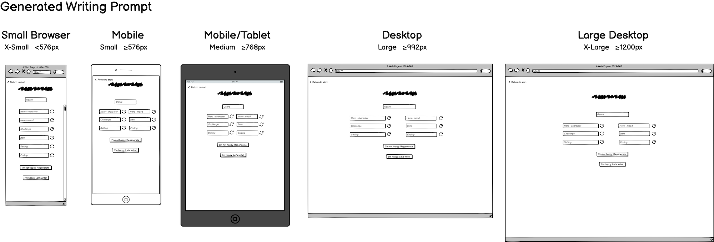
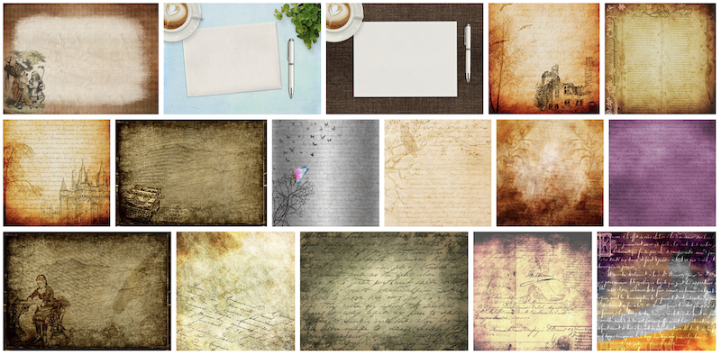

# The Creative Writer

The website completed and presented for Milestone Project 2 is intended to be a tool for inspiring writers in their practice. 
It has been designed and developed using a mobile-first approach, and is accessible and responsive across a range of devices.

<p align="center">
    
</p>

[Visit the deployed site](https://mikiburgess.github.io/MP2-Creative-Writer/)


- - -

## Table of Contents

- [Introduction](#Introduction)
- [User Experience (UX)](#User-Experience-(UX))
  - [Project Goals](#Project-Goals)
  - [Strategy](#Strategy)
  - [Scope](#Scope)
  - [Structure](#Structure)
  - [Skeleton](#Skeleton)
  - [Surface](#Surface)
- Site Development
- Site Features
  - Current Features
  - Future Features
- Guide to Deployment and Development
- Project Reflection
- Credits

- - -


## Introduction

This repository and the associated deployed website comprise my submission for the Diploma in Web Development, Milestone Project 2. 

<kbd>[Return to ToC](#Table-of-Contents)</kbd>
- - -

## User Experience (UX)
This site is targeted at individuals who are looking for writing prompts to inspire their creative writing. The target users and approach to designing and developing this site is discussed below.


### Project Goals
The primary goal of this project is to design, develop and deploy a website to inspire and support writers, specifically those with an interest in creative (fiction) writing.

### Strategy
<!-- What are we aiming to achieve, and for whom? -->
The target audience for this site is for anyone looking for ideas to inspire their creative writing. This ranges from individuals wishing to write a story but don't know where to start, writers looking for writing exercises to develop their skills, to educators looking for a tool to help engage their students in creative writing.
As the focus of this site is supporting writers, the site also needs to be intuitive to use (so they can get writing quickly), and uncluttered (so they can write without distractions, such as adverts and animations).


### Scope
<!-- What features do we want to include in the design? What's on the table, and whats off (for now)? -->
This creative writing prompt generator aims to provide cognitive exercise for the creative writer, inspire the short story writer, and support the daily meditative and free writer. As well as being used by individuals, it's also intended that this tool be a free writing support resource for educators in an upper-high school and/or collage environment.
The needs of these users have been identified and described in the following set of user stories.


#### User Stories
The four identified users for this site are listed below, along with their specific needs:

* As a meditative / free writer I want to ...
  1. be given a starting point and context for my writing
  2. have a clear, minimalist space where I can concentrate solely on writing without distraction of formatting and other tools
  3. be able to retain a record of my writing in case I want to reflect back on it in future

* As a short story writer I want to ...
  1. get random inspiration for my writing
  2. tailor the writing inspiration based on my current mood
  3. be able to retain a copy of my writing for my portfolio

* As a creative writer I want to ...
  1. get random inspiration for my writing
  2. the ability to tailor the writing prompt
  3. be able to retain a copy of my writing for my portfolio  

* As a teacher I want ...
  1. a free to use resource that can be used in the classroom, on any available computing devices (e.g., laptops, tablets, mobile devices, etc).
  2. a tool that can be used to inspire my students in creative writing exercises


### Structure
<!-- How is the information structured, and is it logically grouped? -->
This site will comprise a single HTML page, but with dynamic content that will be constructed and displayed as the site visitor uses the site features. This dynamic behaviour will be developed using JavaScript.

In order to be able to generate a writing prompt, the number of prompt items needs to be decided and a suitable set of data created for each.
The data for all writing prompt elements will be stored in JavaScript objects - one per writing prompt element: 

```javascript
{name: "", icon: "fa-solid ", emojisym: "", genre: []}
```
- `name` => the displayed text for the writing prompt element (eg, for the 'villain' prompt element the name may be 'vampire').
 - `icon` => reference to a 'fontawesome' icon used to represent this element (eg, an icon for a 'vampire'). [*key included ready for future site development*]
 - `emojisym` => symbol for the emoji that can be used to represent this element (eg, the 'vampire' emoji). [*key included ready for future site development*]
 - `genre[]` => array containing all genres for which this element is applicable (eg, for 'vampire' this would include 'Scary' and 'Fantasy').

This approach was taken as in future this could be easily developed into a JSON or SQL data storage facility.

Initially four genres and two 'flexible' options will be stored in an array:
```javascript
const genres = ["General", "Historical", "Fantasy", "Adventure", "Scary"];
```
This decision was made to again support future development by expanding the available genres.\
\
\
The backed file structure was implemented according to the following design:


    - 📰 index.html           <-- single, dynamically constructed page
    - 📂 assets
        - 📂 css
            - 📰 style.css    <-- CSS stylesheet 
        - 📂 images           <-- folder containing all site images 
        - 📂 scripts
            - 📰 data.js      <-- Javascript - containing all site data
            - 📰 script.js    <-- JavaScript - code for site construction and interaction
            - 📰 sendMail.js  <-- JavaScript - code for sending email using EmailJS
*Figure 1: Design of site file structure*


### Skeleton
<!-- How the information should be implemented, and how the user will navigate through the info/features -->
The site will comprise a single page, with content dynamically constructed as the user navigates through the creative writing process using site buttons to control progress between each stage.

The activity flow through the site will be as follows:
```
 Starting point => Stage 0 - Welcome: Introduction to the site.
 leads to => Stage 1 - Genre Selection: Set of options from which user can select.
 leads to => Stage 2 - Writing Prompt Generation: View and edit a the randomly generated writing prompt for the selected genre.
 leads to => Stage 3 - Writing Area: Space for writing a story based on the generated writing prompt.
 leads to => prompt and writing being emailed to site user
```

#### Wireframes
A set of wireframes were developed to guide the site build. For each stage in the application flow a wireframe was designed for the following Bootstrap breakpoints: X-Small, Small, Medium, Large, X-Large. These were created to ensure responsiveness across devices/viewports.

In addition, two further sets of wireframes were created to support site implementation. These latter two focussed only on the small (mobile phone) device size, supporting the mobile-first approach to design.\
\
\

*Figure 2: Stage 0 - Welcome to the Site*


*Figure 3: Stage 1 - Genre Selection*


*Figure 4: Stage 2 - Writing Prompt Generation and Display*


*Figure 5: Stage 3 - Writing Area*


*Figure 6: Site structure and elements (classes & ids)*


*Figure 7: Code elements (site functionality & interactivity)*\
\
\
Minor adjustments were made to the final design based on reflection during the development stage. However these were minimal. 


### Surface
<!-- What the product will actually look like, colors, typography, images, design elements, etc -->
The surface design decisions of the site were driven by the idea of writing, and specifically writing in a book.

#### Background Image
A background image was selected to replicate the feeling of an old handwritten notebook, supporting the theme of creative writing. Pixabay was used to identify a number of candidate background images.

<p align="center">
    
</p>

*Figure 8: Candidate site background images*

The final decision was made by selecting an image that would be unobtrusive and usable across multiple devices (i.e., suitable for a responsive site). 

#### Color Palette
The color palette for the site was created using [Coolors](https://coolors.co/) to be complementary to the selected background image.

<p align="center">
    
</p>

*Figure 9: Site color palette*

These colors were defined as names variables in the stylesheet to support color consistency across the site and improve code readability:

```javascript
:root {
    --palette-pale-opaque: rgba(255, 230, 168, 0.8);
    --palette-pale: #ffe6a8;
    --palette-chocolate: #99582A;
    --palette-dark: #432818;
    --palette-caramel: #BB9457;
    --palette-caramel-opaque: rgba(186, 149, 89, 0.25);
    --palette-rich: #6F1D1B;
}
```

#### Typography
To maintain the style of a handwritten notebook, two cursive fonts were selected for use throughout the site. These were supplemented by a serif font for supplementary text (primarily site buttons).

The following fonts were selected for use across the site:
- [Charm](https://fonts.google.com/specimen/Charm) - a grand, cursive font the main site header (`<h1>`), and 'restart' button.
- [Kalam](https://fonts.google.com/specimen/Kalam)  - a cursive font for most text on the site, including the user writing area (`<textarea>`)
- [Libre Baskerville](https://fonts.google.com/specimen/Libre+Baskerville) - a crisp serif font for other site headings, site buttons and the site footer.

#### Site Images
A selection of royalty-free images were chosen from [Pixabay](https://pixabay.com/) to represent each of the four genres, and the two additional options. The focus again was on drawings rather than photographs, considering the types of sketches a writer may include in their notebook.

#### Accessibility
Site accessibility was considered throughout the design, development and testing process. This was guided by [W3C ARIA guidelines](https://www.w3.org/WAI/ARIA/apg/) and [MDN](https://developer.mozilla.org/en-US/docs/Web/Accessibility/ARIA).


<kbd>[Return to ToC](#Table-of-Contents)</kbd>
- - -

## Site Functionality
The Creative Writer is a single page site that is dynamically constructed according to user interaction. The following presents a walkthrough of it's current features.

A number of further developments are planned which will improve functionality, accessibility and the overall user experience (UX). These are discussed later under [Future Features](#Future-Features).

(*Note - Figure labels have been omitted from this section for clarity.*)


### Stage 0: Welcome to the Site
The current start page welcomes site visitors. The user then clicks the button to begin.

<p align="center">
    
</p>

<!-- *Figure 10: Current start page (stage 0)* -->

**Stage 1:** The user is presented with a number of story themes, or 'genres', from which they can select. 
When selected the 'chosen genre' text will update to tell the user which genre they have currently chosen.

<p align="center">
    
</p>

<!-- *Figure 11: Genre selection (stage 1)* -->

**Stage 1:** Once ready the user clicks the button to confirm their chosen genre. This selection will then focus the type of writing prompt to be generated at the next stage.

<p align="center">
    
</p>

<!-- *Figure 12: Confirm genre selection (stage 1)* -->

**Stage 2:** A writing prompt is randomly generated according to the user selected genre. 
If the user is unhappy and wants a different set of elements, clicking the *"I'm not happy"* button will generate a new set of writing prompt elements.
If the user wishes to modify any single element, clicking the associated refresh icon (button) will randomly select another (leaving the others unchanged). 
Once happy, the user can click the *"I'm happy"* button, which takes them to the next stage.

<p align="center">
    
</p>

<!-- *Figure 13: Generated writing prompt (stage 2)* -->

**Stage 3:** The final page of the site displays the final, complete writing prompt to the user, who can then use the text area to compose their story/prose. This area include no formatting or spell checking tools to support the free, stream-of-consciousness writing style to encourage the creative writer explore their imagination.

<p align="center">
    
</p>

<!-- *Figure 14: Writing area (stage 3)* -->

**Finishing Up:** When the user has completed their writing exercise, of simply wishes to save the writing prompt for use later, entering their email in the space provided and clicking the *"Send email"* button will sent the prompt and any text they have written directly to their inbox.

<p align="center">
    
</p>

<!-- *Figure 15: Sending an email* -->

For example, based on the prompt and text written in the above example the user will receive the following email:

<p align="center">
    
</p>

<!-- *Figure 16: Email sent from 'The Creative Writer'* -->


<kbd>[Return to ToC](#Table-of-Contents)</kbd>
---


## Site Development
### Development Tools
- UI Wireframes were created using [Balsamiq](https://balsamiq.com/)
- Code was be developed locally using [Visual Studio Code](https://code.visualstudio.com/)
- [Chrome DevTools](https://developer.chrome.com/docs/devtools/), as embedded within Google's Chrome browser, were used to support the development. In particular, the code inspector, [Lighthouse](https://developer.chrome.com/docs/lighthouse/), and the responsive design checker (for checking site responsiveness across all viewports)
- Completed site was deployed using [GitHub Pages](https://pages.github.com/).

### Version Control
Versioning was managed locally using [Git](https://git-scm.com/). 

Code was committed regularly during the development process, with each commit being labelled according to the work type.

*Table 1: Summary of Git Commit Types*

| *TYPE* | *DESCRIPTION* |
| --- | --- |
| `ADD` | Adding general content |
| `BUILD` | Code/Project build changes |
| `DOCS` | Modifications/updates relating to project documentation |
| `FEAT` | Adding a new feature to the application |
| `FIX` | Fixing a bug/issue |
| `REFACTOR` | Code modifications/maintenance that are not fixes or features |
| `STYLE` | Modifications/updates relating to styling |
| `TEST` | Updates relating to testing (practical and documentation) |
| `UPDATE` | Modifying existing code functionality |

All committed code was regularly pushed to [GitHub](https://github.com/mikiburgess).


### Project Management
Project planning and management was done using the GitHub Projects tool (i.e. a digital Kanban board).

### Languages & Libraries
This site was developed using HTML, CSS, JavaScript and JQuery. 
Comments were added throughout all code files for explanation (where appropriate) and clarifying structure.

The [EmailJS](https://www.emailjs.com/) JavaScript library was employed to send an email from the site to the user.

### Frameworks
This project employed the Bootstrap v5.3 framework for basic site styling, with additional CSS styling incorporated to tailor the site to the needs of the target audience. Bootstrap support was obtained through the official [Bootstrap documentation](https://getbootstrap.com/), [W3Schools](https://www.w3schools.com/bootstrap5/index.php).


<kbd>[Return to ToC](#Table-of-Contents)</kbd>
- - -

## Testing
Full overview and results of site testing can be found in [TESTING.MD](docs/testing/TESTING.md).

<kbd>[Return to ToC](#Table-of-Contents)</kbd>
- - -

## Guide to Deployment and Development
This section describes how to use the project repository for deploying the site or for undertaking further local development.

In order to navigate to the start of the project repository you can either scroll to the top of this page, or click on [mikiburgess/MP2-Creative-Writer](https://github.com/mikiburgess/MP2-Creative-Writer/).


### Deployment
[GitHub Pages](https://pages.github.com/) was used to deploy the live website. The instructions to achieve this are below:

1. Log in (or sign up) to GitHub.
2. Navigate to the project repository.
3. Click on the Settings link.
4. Scroll down to find the Pages link in the left hand side navigation bar.
5. Click on the Pages link and locate the Build and Deployment section.
6. Under the Source option, select *Deploy from a branch* from the drop-down box.
7. Under the Branch section, select *master* then */(root)* from the two drop-down boxes, then click Save. 

The site will now be deployed by GitHub Pages and available at the URL shown near the top of the page. Click on the Visit Site button to be taken there directly.

### Local Development

#### How to Fork this Project Repo
1. Log in (or sign up) to Github.
2. Navigate to the project repository.
3. Click the Fork button at the top right of the page.

#### How to Clone this Project Repo
1. Log in (or sign up) to GitHub.
2. Navigate to the project repository.
3. Click on the Code button, ans select the Local tab.
4. Select whether you would like to clone with HTTPS, SSH or GitHub CLI.
5. Copy the link shown by clicking the 'copy' button.
6. Open the  in your code editor and change the current working directory to the location you want to use for the cloned directory.
7. Type the command 'git clone' into the terminal and then paste the link you copied from GitHub. 
8. Press enter. You will now have a clone of the project repo.


<kbd>[Return to ToC](#Table-of-Contents)</kbd>
- - -

## Project Review and Reflection


### Improvements to Design and Development

#### Automated Testing
Manual testing was undertaken before project completion. However, this process could be improved and the site more robust through the inclusion of automated testing (ideally, taking a test-driven approach to development). Initially this would use the [Jest JavaScript Testing Framework](https://jestjs.io/), but extended to other testing methods and frameworks as knowledge and skills develop. 

Full details of the approach to testing that has been taken and the ways in which this could be developed in future can be found in the accompanying [TESTING.MD](docs/testing/TESTING.md) page.

#### Improved Code Efficiency
In a few areas the code could be made more efficient with additional work and refactoring. For example, the `generatePrompt()` function could be shorter by using suitable data structures and loops to generate the individual elements of the writing prompt as opposed to the current repetition. 

#### Improved Site Flexibility
The above would also enable the site to be more flexible, allowing for fewer or more prompt elements based on user preference. This could then propagate through the code to dynamically generate the displaying and saving of the final complete prompt.

#### Improved Data Storage
Writing prompt data is currently stored in memory whilst the user interacts with the site, being included in the `data.js` script file that is loaded into memory upon first site load. Due to this approach, the amount of data has been kept intentionally small.
A more efficient approach to data storage would use a structured JSON file to hold all site data, and only those areas relevant to the current site visit then loaded into memory.
A further improvement would be the addition of a light-weight backend database, such as SQLite, to enable a larger collection of writing prompt data to be stored and used, providing site visitors with a broader array of writing inspirations.


### Future Features

#### Initial Developments
The following developments would be incorporated within the first 1-3 months of further development, with the aim of completing these before official site launch.

##### Alternative Color Scheme
The current site color palette was selected according to the aim of replicating the feel of an old, handwritten book. However, this has resulted in a site across which may be difficult to access for some visually impaired individuals. The addition of other color schemes is therefore required to improve accessibility for all site visitors. 
This development will comprise the following:
 - A *high contrast* color palette that can be applied to improve accessibility
 - A *dark mode* option to support users who prefer a darker color scheme, such as when using the site at night.

##### Site Alerts 
The current site relies on popup alerts for the user to confirm/cancel requests to restart from the welcome page and to make sure they select a genre before a writing prompt can be generated. This is potentially problematic as site visitors may have disabled popups for security reasons. The site will therefore be developed further to remove popups and use only in-site notifications (such as the one currently included to confirm to the user that their email has been sent).

##### Expand Genre Card Functionality
Site visitors currently have to click the the genre buttons to select a writing prompt genre. Site interaction could be improved by allowing users to click on the genre illustrations as well as the buttons.

##### Develop the 'Experiment' Option
The *Experiment* option has been included as a starting point for future development. The final aim of this option will be to allow the user to refresh the genre option as well as the individual prompt elements, and be able to generate a prompt using data across all genres. This will provide more flexibility with regard to tailoring the writing prompt, and is aimed specifically at the user 'Creative Writer'. 

##### Show Last Clicked Genre Button
When a genre selection button is clicked, the selected genre is displayed in the scroll image at the top of the page. When using a small or medium viewport this can result in the user needing to scroll up in order to see and confirm the current selection. Site usability could be improved by updating the formatting of the most recently selected genre button by adding an active class for dynamic CSS styling, then removing that class when another option is selected.

#### Future Developments
Once the initial developments have been completed and version 1 of the site launched for general use, the following features would be developed. This development process would follow a review of the 

##### Visitor Feedback Option
Once writers have used this site they may have suggestions for additional features that would help them in their creative writing, or requests for additional genres/themes. In order to ensure the site remains appropriate for the intended target audience a site feedback form will be added. Relevant/appropriate feedback will then be considered and feed into future development plans.

#### Hide 'Return to Start' on welcome page
At every stage of the site the '*Return to Start*' option is present and available in the top-left corner. When viewing the initial welcome page the presence of this button is superfluous, as the effect of clicking this would be to view the same page and clear data (variables) that were already cleared when the page loaded. Therefore, in future versions of this site the '*Return to Start*' option will not be present on the welcome page.

##### Include Icons & Emojis
The current JavaScript objects used to store writing prompt data include references to [Fontawesome](https://fontawesome.com/) icons and [Emojis](https://www.webfx.com/tools/emoji-cheat-sheet/) that can be used to graphically represent each prompt element. Some currently hold temporary references, but once developed further these can be added to the site to illustrate each writing prompt element. The potential also exists for the prompt generator to be revised to provide the option of generating either written or visual creative writing prompts.

##### PDF Generator
In addition to the ability to email the generated prompt and (if completed) the corresponding story, the facility to save as a formatted PDF document could be added to the site. This additional option would increase service flexibility by facilitating the easy saving and printing of the users work. This feature could be developed in Javascript using one of the many available libraries, such as [pdfme](https://github.com/pdfme/pdfme), or utilise an existing web service. This expansion could also be developed further to allow for text download, or other formats. 

##### Incorporating Generative AI Tools
Due to the increasing availability of generative AI tools, these could be incorporated into the site to support users further in their creative writing. For example:
- Incorporating a text generator, such as [ChatGPT](https://chat.openai.com/), to create an alternative story from the generated writing prompt. This could be used to compare and contrast against the writers own story, which would be of use in student reflection activities in a learning environment.
- Sending the completed story to an image generator, such as [DALL-E 2](https://openai.com/dall-e-2)  ...
- Including the option to generate a visual prompt rather than a text prompt. Using any of the number of AI image generators a text prompt could be generated, sent to the image generator, and the image displayed as the inspiration for a creative writing activity.


<kbd>[Return to ToC](#Table-of-Contents)</kbd>
- - -

## Credits

### Site Media
- All images obtained from [Pixabay](https://pixabay.com/) are free to use under their [Content License](https://pixabay.com/service/license-summary/). The individual creators for these images are as follows:
  - Site background - [ArtsyBee](https://pixabay.com/users/artsybee-462611/)
  - Adventure - [Franz26](https://pixabay.com/users/franz26-1553839/)
  - Historical - [darksouls1](https://pixabay.com/users/darksouls1-2189876/)
  - Fantasy - [psychofladoodle](https://pixabay.com/users/psychofladoodle-19768699/)
  - Scary - [intographics](https://pixabay.com/users/intographics-2633886/)
  - Just Write! - [Art_Dreams](https://pixabay.com/users/art_dreams-5864742/)
  - Experiment! - [ArtTower](https://pixabay.com/users/arttower-5337/)
- Site icon - by junichi hayama from [Noun Project](https://thenounproject.com/browse/icons/term/write/) (CC BY 3.0), free to use with attribution (added to site footer).

### Additional Code and Resources
- The fonts used in this project are from [Google](https://fonts.google.com/) and [Fontawesome](https://fontawesome.com/). 
- Information badges at top of README created using [Shields.io](https://shields.io/)

### Learning Resources
- Development of the two project markdown files were supported through reference to the following three resources:
  - GitHub's [Writing on GitHub](https://docs.github.com/en/get-started/writing-on-github) documentation, 
  - Kera Cudmore's [Readme Examples](https://github.com/kera-cudmore/readme-examples/blob/main/milestone1-readme.md) for Code Institute Diploma Students,
  - Adam Pritchard's [Markdown Cheatsheet](https://github.com/adam-p/markdown-here/wiki/Markdown-Cheatsheet).
- General accessibility guidance was obtained from the [W3C ARIA guidelines](https://www.w3.org/WAI/ARIA/apg/).
- Guidance on ARIA roles and attributes obtained from [MDN](https://developer.mozilla.org/en-US/docs/Web/Accessibility/ARIA).
- Additional learning on Bootstrap 5 was undertaken using the [W3Schools Bootstrap 5 Tutorial](https://www.w3schools.com/bootstrap5/index.php).
- Guidance on using the three Lighthouse modes (user flows) was obtained from Google Chrome's [Lighthouse documentation](https://github.com/GoogleChrome/lighthouse/blob/HEAD/docs/user-flows.md).

### Inspiration
- Inspiration for The Creative Writer comes from the various books, magazines and tools that help writers by providing prompts to kickstart creative writing. One such tool is the [Writing Inspiration Dice from Two Tumbleweeds](https://www.twotumbleweeds.co/products/writing-dice-inspiration-for-creative-writing)
- The structure of this readme document was inspired by MP2 projects from my Code Institute peers Siobhan Gorman's [Mixtape Quiz](https://github.com/siobhanlgorman/80s-Mixtape-Quiz), Moira Hartingigan's [Alien Memory Game](https://github.com/moirahartigan/Portfolio-2---Alien-Memory-Game) and Emma Hewson's [Travel Quiz](https://github.com/emmahewson/mp2_travel_quiz/tree/main)
- The use of the [EmailJS](https://www.emailjs.com/) library for sending emails in JavaScript was inspired by the Code institute 'Interactive Resume' walkthrough project. 

### Acknowledgements
I would like to acknowledge the following people who helped me complete this milestone project:
- [Iris Smok](https://github.com/Iris-Smok) - our Code Institute cohort facilitator.
- [Jubril Akolade](https://github.com/Jubrillionaire) - my Code Institute mentor.
- The Code Institute Slack community, including the feb-2023-pla cohort channel. 
- My volunteer human testing and feedback team of Dr N Caine, Dr W Ivins, Ms H Phillips, and Mr J Ivins.


<kbd>[Return to ToC](#Table-of-Contents)</kbd>
- - -
