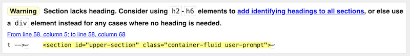
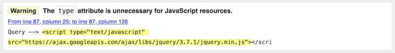
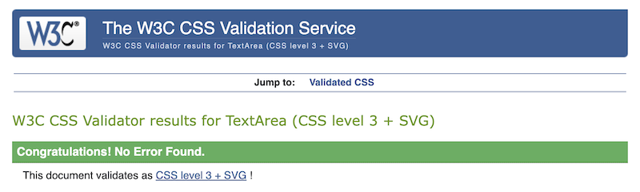
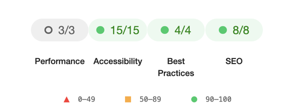
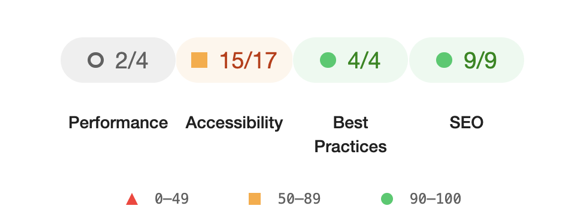
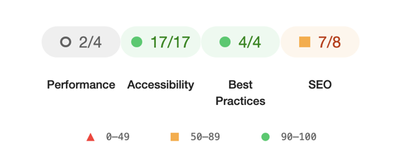
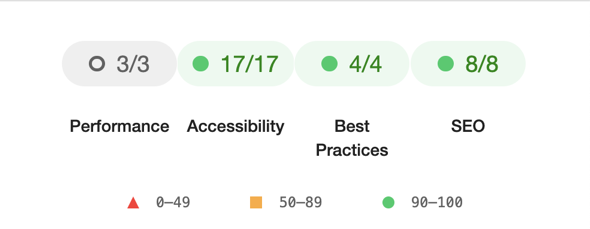
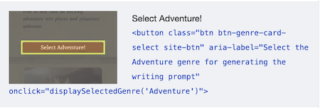

# Testing 'The Creative Writer'

Overview of the testing of Milestone Project 2 - The Creative Writer.

<p align="center">
    
</p>

- - -

## Table of Contents

   - [Introduction](#Introduction)
   - [Browser Compatibility](#Browser-Compatibility)
   - [Site Responsiveness](#Site-Responsiveness)
   - [Code Validation](#Code-Validation)
   - [Lighthouse Testing](#Lighthouse-Testing)
   - [User Stories](#User-Stories)
   - [Features](#Features)
   - [Bugs and Issues](#Bugs-and-Issues)


- - -


## Introduction
This document describes the testing process and results for Milestone Project 2. For additional project details please refer to:
- [Main project README document](../../README.md)
- [Deployed web site](https://mikiburgess.github.io/MP2-Creative-Writer/)


<kbd>[Return to ToC](#Table-of-Contents)</kbd>
- - -

## Browser Compatibility
Browser compatibility testing was completed with Chrome, Firefox, Safari and Opera, running on a MacBook. Edge and IE were not tested at this stage due to lack of access to those browsers. Before professional site deployment, compatibility would need to be tested on Windows-specific and a selection of mobile-specific browsers.

*Table 1: Browser responsiveness test results*

| | CHROME | FIREFOX | SAFARI | OPERA | Notes | 
| ----------- | ----------- | ----------- | ----------- | ----------- | ----------- 
| Intended appearance? | Good | Good | Good | Good | No issues identified |
| Intended responsiveness? | Good | Good | Good | Good | No issues identified |

Results of the testing undertaken on each browser can also be seen in the following folders: [Chrome](browsers/chrome/), [Firefox](browsers/firefox/), [Safari](browsers/safari/), [Opera](browsers/opera/).


<kbd>[Return to ToC](#Table-of-Contents)</kbd>
- - -

## Site Responsiveness
Responsiveness tests were undertaken using Google Chrome DevTools and the online tools [Responsive Design Checker](https://responsivedesignchecker.com/) and [AmIResponsive](https://ui.dev/amiresponsive). All tests were conducted using a MacBook. 
Due to lack of access to multiple devices, all device responsiveness tests were completed using the [Google Chrome DevTools simulation tool](https://developer.chrome.com/docs/devtools/device-mode/). Before professional site deployment, responsiveness would need to be tested on real devices.


<p align="center">
    
    <br><em>Figure 1: Responsive Design Checker Example</em>
</p>

<p align="center">
    
   <br><em>Figure 2: AmIResponsive Example</em>
</p>


The following tables contain screenshots and results of the responsiveness tests.


*Table 2: Results of responsive tests on simulated devices*

| *TOOL* | *TESTS* |  
| ----------- | ----------- |
| [AmIResponsive](https://ui.dev/amiresponsive) | [Stage 0](responsive/amiresponsive-stage-0.png), [Stage 1](responsive/amiresponsive-stage-1.png), [All stages](responsive/amiresponsive.png) |
| [Response Design Checker](https://responsivedesignchecker.com/) | [Google Pixel](responsive/rdc-google-pixel.png), [iPhone 6](responsive/rdc-iphone-6.png), [iPad Pro](responsive/rdc-ipad-pro.png), [Samsung Galaxy Tab 10](responsive/rdc-samsung-galaxy-tab-10.png), [10-inch Notebook](responsive/rdc-10inch-notebook.png), [22-inch Desktop](responsive/rdc-22inch-desktop.png) |
| [Google Chrome DevTools](https://developer.chrome.com/docs/devtools/device-mode/) | [iPad-landscape](responsive/chrome-simulated-ipad-landscape/), [iPad-portrait](responsive/chrome-simulated-ipad-portrait/), [Moto G4-landscape](responsive/chrome-simulated-moto-g4-landscape/), [Moto G4-portrait](responsive/chrome-simulated-ipad-portrait/) |


*Table 3: Results of responsive tests across Bootstrap Breakpoints*

| Stage | *XS* | *SM* | *MD* | *LG* | *XL* | *XXL* | *Comment* |
| --- | --- | --- | --- | --- | --- | --- | --- |
| 0. Welcome | [xs](responsive/bootstrap-breakpoints/1-stage0-xs.png) | [sm](responsive/bootstrap-breakpoints/2-stage0-sm.png) | [md](responsive/bootstrap-breakpoints/3-stage0-md.png) | [lg](responsive/bootstrap-breakpoints/4-stage0-lg.png) | [xl](responsive/bootstrap-breakpoints/5-stage0-xl.png) | [xxl](responsive/bootstrap-breakpoints/6-stage0-xxl.png) | No issues |
| 1. Genre Selection | [xs](responsive/bootstrap-breakpoints/1-stage1-xs.png) | [sm](responsive/bootstrap-breakpoints/2-stage1-sm.png) | [md](responsive/bootstrap-breakpoints/3-stage1-md.png) | [lg](responsive/bootstrap-breakpoints/4-stage1-lg.png) | [xl](responsive/bootstrap-breakpoints/5-stage1-xl.png) | [xxl](responsive/bootstrap-breakpoints/6-stage1-xxl.png) | No issues |
| 2. Writing Prompt | [xs](responsive/bootstrap-breakpoints/1-stage2-xs.png) | [sm](responsive/bootstrap-breakpoints/2-stage2-sm.png) | [md](responsive/bootstrap-breakpoints/3-stage2-md.png) | [lg](responsive/bootstrap-breakpoints/4-stage2-lg.png) | [xl](responsive/bootstrap-breakpoints/5-stage2-xl.png) | [xxl](responsive/bootstrap-breakpoints/6-stage2-xxl.png) | No issues |
| 3. Writing Page | [xs](responsive/bootstrap-breakpoints/1-stage3-xs.png) | [sm](responsive/bootstrap-breakpoints/2-stage3-sm.png) | [md](responsive/bootstrap-breakpoints/3-stage3-md.png) | [lg](responsive/bootstrap-breakpoints/4-stage3-lg.png) | [xl](responsive/bootstrap-breakpoints/5-stage3-xl.png) | [xxl](responsive/bootstrap-breakpoints/6-stage3-xxl.png) | No issues |


<kbd>[Return to ToC](#Table-of-Contents)</kbd>
- - -

## Code Validation
Project HTML, CSS and JavaScript code were parsed by online code validation tools. The following sections describe the validation process and discuss the returned results.

### HTML Validation
The [W3C Markup Validation Service](https://validator.w3.org/#validate_by_input) was used to check project HTML (using the 'direct input' option). Two warnings were identified.

The validator highlighted that html `section`'s should contain headings. Headings were intentionally omitted during the development process as sections were included to distinguish between the three areas of the site page, not indicate visual page areas. `Section` was used to be more intuitive to the human reader (eg, during code development and maintenance). 
Considering the feedback from the validator, in future the more appropriate `div` element will be used rather than `section`.

 
*Figure 3: Section headings*

The validator also highlighted that, when referring to JavaScript resources, including ```type="text/javascript"``` is superfluous. This was included for code readability and has no impact on functionality ot performance. However, these could be removed in future.

 
*Figure 4: Script elements*

No other issues were identified by the validator.

### CSS Validation
The [W3C Jigsaw Validation Service](https://jigsaw.w3.org/css-validator/#validate_by_input) was used to check project CSS (using the 'direct input' option).
No issues or warnings were raised.

 
*Figure 5: Result of CSS Validation*

### JavaScript Validation
The three JavaScript files were validated using [JSHint v2.13](https://jshint.com/). 

`data.js`
- 13 unused variables: These are not used within this script file, but used by code in script.js

`script.js`
- 14 undefined variables: These refer to the data stored in the external data file
- 6 unused variables: These refer to code that is called from HTML elements (buttons)

`sendMail.js`
- 1 undefined variable: Refers to `emailjs` function from the [EmailJS](https://www.emailjs.com/) library, loaded within `index.html`. 
- 1 unused variable: Refers to the function `emailWriting` which is unused within this script file, but is called from a site button (other code).

No other issues were raised.

<kbd>[Return to ToC](#Table-of-Contents)</kbd>
- - -

## Lighthouse Testing
The [Lighthouse](https://developer.chrome.com/docs/lighthouse/overview/) tool in Google Chrome was used to test site performance, accessibility and best practice.

The Creative Writer comprises a single page, `index.html`, which is dynamically updated as the visitor navigates the site using the buttons. Lighthouse testing was therefore undertaken in Snapshot mode, analysing each state of the site.

*Table 4: Summary of Lighthouse Testing Results*

| *SECTION* | *RESULT* | *REPORT* |
| :--- | :---: | :---: |
| Stage 0: Initial Welcome Page |  | [pdf](lighthouse/reports/lighthouse-stage0-summary-report.pdf) |
| Stage 1: Story Genre Selection Page |  | [pdf](lighthouse/reports/lighthouse-stage1-summary-report.pdf) |
| Stage 2: Writing Prompt Page |  | [pdf](lighthouse/reports/lighthouse-stage2-summary-report.pdf) |
| Stage 3: Writing Area Page |  | [pdf](lighthouse/reports/lighthouse-stage3-summary-report.pdf) |


One of the main issues highlighted during testing was color contrast could be improved. This had already been considered and been marked as an area for future development.

<kbd>[Return to ToC](#Table-of-Contents)</kbd>
- - -

## User Stories
To validate the achievement of original website goals, the table below revisits every user story and reviews how each is achieved by the final website.

*Table 5: User Story Validation*

| *USER STORY* | *VALIDATION* |
| ----------- | ----------- |
| ***Meditative / Free Writer*** | ----- |
| 1. be given a starting point and context for my writing | Site generates a variety of writing prompts and an area for composing prose based on that prompt |
| 2. have a clear, minimalist space where I can concentrate solely on writing without distraction of formatting and other tools | A plain, minimalist text writing area is provided, without distraction of formatting, spelling and other tools |
| 3. be able to retain a record of my writing in case I want to reflect back on it in future | Email facility included that will send all writing (prompt & prose) to the user's email address |
| ***Short Story Writer*** | ----- |
| 1. get random inspiration for my writing | Site generates random writing prompts from a pool (file) of options |
| 2. tailor the writing inspiration based on my current mood | Site generates random prompts according the the user-selected genre, selected based on their current mood. Each part of the generated prompt can also be modified by 'refreshing' the individual prompt elements |
| 3. be able to retain a copy of my writing for my portfolio | Email facility included that will send all writing (prompt & prose) to the user's email address |
| ***Creative Writer*** | ----- |
| 1. get random inspiration for my writing | Site generates random writing prompts from a pool (file) of options |
| 2. the ability to tailor the writing prompt | Site enables the user to tailor their writing prompt first by selecting a story genre, then each part of the generated prompt can be modified by 'refreshing' the individual prompt elements. This tailoring will be improved in future work (see [README](../../README.md) for more details). |
| 3. be able to retain a copy of my writing for my portfolio | Email facility included that will send all writing (prompt & prose) to the user's email address |
| ***Teacher*** | ----- |
| 1. a free to use resource that can be used in the classroom, on any available computing devices (e.g., laptops, tablets, mobile devices, etc). | Site is free to use and has been tested across a variety of viewports and simulated devices. |
| 2. a tool that can be used to inspire my students in creative writing exercises | Users are guided through creating a writing prompt that can be used directly within the site, a different writing tool or a handwritten notebook |

<kbd>[Return to ToC](#Table-of-Contents)</kbd>
---

## Features
All site features have been manually tested. The results of these tests are shown in the tables below:

*Table: Stage 6 - Genre Selection *
| Feature | Expected Outcome | Action | Result | Pass/Fail | 
| ------- | ------- | ------- | ------- | ------- |
| Return to Start | Clicking 'Return to Start' will raise an alert asking user to confirm |  Click 'Return to Start'| Alert shown | Pass | 
|  |  | |  | Pass | 
| Genre selection | Clicking on any genre button will update the genre text displayed at the top of the page | Click genre button(s) | Genre text displayed at the top of the page | Pass (for all genre buttons) | 
|  |  | |  | Pass | 
|  |  | |  | Pass | 

<kbd>[Return to ToC](#Table-of-Contents)</kbd>
- - -

## Bugs and Issues
The following describes the main issues that were detected and corrected during the testing process.

### Updates and Fixes
The following sections describe those bugs/issues that were identified and rectified during the development process.

#### Site Loading Notification
The landing page, `index.html`, contains limited static content. Most page content is constructed dynamically as the site is used. 
When loading the initial landing page, a number of elements need to be loaded before the site initialises and becomes usable. These include a full screen background image, stylesheets, fonts/icons and scripts. The welcome page content is then constructed and `index.html` updated. As such, there is the potential that with a very slow internet connection there could be a small delay as the site initialises. Although unlikely, a [Bootstrap 5 site spinner](https://getbootstrap.com/docs/5.0/components/spinners/) with information text was added to the upper section of the site. This is usually unnoticeable, as it is usually quickly replaced with site content generated by the accompanying script.

<p align="center">
    
   <br><em>Figure: Site Loading notification with Bootstrap spinner</em>
</p>

No issues with site loading was identified during development and testing. However, this notice and spinner was added to engage with the user just in case of any connection delays in the future.

#### User Testing
Once the site was complete, a small number of human users tested the site on their personal devices.
The feedback was generally positive, but they highlighted the following potential issue with the genre selection page.

The button at the bottom of the genre selection page was initially labelled "Inspire me ...". Having selected a genre, two of the testers asked what they needed to do next, as the next move was not obvious. The text on this button was therefore updated from "Inspire me ..." to "Show me my writing prompt ..."

<p align="center">
    
   <br><em>Figure: Original and Updated button</em>
</p>

Having updated the text, the purpose of this button is now clearer.

#### Performance Analysis using Lighthouse
During initial Lighthouse testing a few issues were raised:
1. Scroll image missing an `alt` text: This decorative image didn't require any alternative text, but the aria-hidden attribute was unintentionally missed during development. This was therefore corrected with the addition of attribute `aria-hidden="true"`.  
2. aria-labels for a number of the site buttons didn't exactly match the button text: Although the labels described the functionality, the text needed to match more closely. These were therefore updated based on Lighthouse feedback

<p align="center">
    
   <br><em>Figure: Example of aria-label mismatch</em>
</p>

### Outstanding Issues
Further work is still required before the site can be published for general use. The plan is to complete the following before undertaking further development(described in [README](../../README.md)), launching the site and adding it to my professional portfolio of work.

#### Duplicate Prompt Elements
In order to generate each element of the writing prompt, an element is randomly selected from a list of appropriate options. This is done using Javascript's `Math.random()` function. For example, to select a 'Hero' an item is randomly selected from an array of candidate heroes, relevant to the user-selected genre:

```javascript
writingPrompt.hero = storyHeroes[Math.floor(Math.random() * storyHeroes.length)];
```
This approach gives rise to the possibility that the same element may be selected twice, or more, in succession when the user selects the associated 'refresh' option. This then gives the appearance that the option has not refreshed.

<p align="center">
    
   <br><em>Figure: Hero writing prompt element with refresh button</em>
</p>

To combat this, when the refresh button is selected the new element needs to be checked against the existing element, and the process repeat until the new element does not match the exiting element.

#### Site Color Contrast
Further consideration needs to be given to the color palette, increasing color contrast in order to improve site accessibility. 
This was identified through both personal reflection and Lighthouse testing, and has been included in future work proposals (outlined in [README](../../README.md)).

<kbd>[Return to ToC](#Table-of-Contents)</kbd>
- - -