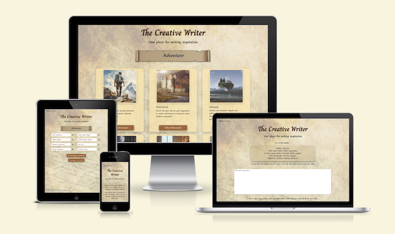
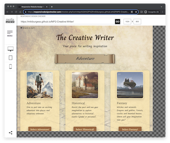
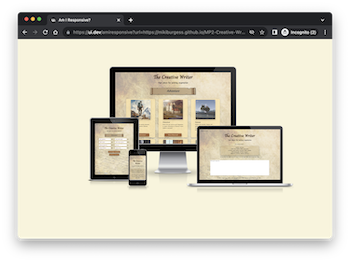
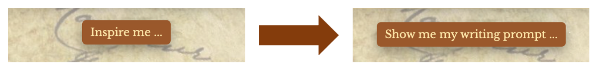
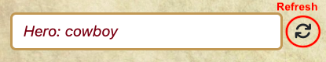

# Testing 'The Creative Writer'

Overview of the testing of Milestone Project 2 - The Creative Writer.

<p align="center">
    
</p>

- - -

## Table of Contents

   - [Introduction](#Introduction)
   - [Browser Compatibility](#Browser-Compatibility)
   - [Site Responsiveness](#Site-Responsiveness)

- - -

## Introduction
This document describes the testing process and results for Milestone Project 2. For additional project details please refer to:
- [Main project README document](../../README.md)
- [Deployed web site](https://mikiburgess.github.io/MP2-Creative-Writer/)

- - -

## Browser Compatibility
Browser compatibility testing was completed with Chrome, Firefox, Safari and Opera, running on a MacBook. Edge and IE were not tested at this stage due to lack of access to those browsers. Before professional site deployment, compatibility would need to be tested on Windows-specific and a selection of mobile-specific browsers.


| | CHROME | FIREFOX | SAFARI | OPERA | Notes | 
| ----------- | ----------- | ----------- | ----------- | ----------- | ----------- 
| Intended appearance? | Good | Good | Good | Good | No issues identified |
| Intended responsiveness? | Good | Good | Good | Good | No issues identified |

Results of the testing undertaken on each browser can also be seen in the following folders: [Chrome](browsers/chrome/), [Firefox](browsers/firefox/), [Safari](browsers/safari/), [Opera](browsers/opera/).

- - -

## Site Responsiveness
Responsiveness tests were undertaken using Google Chrome DevTools and the online tools [Responsive Design Checker](https://responsivedesignchecker.com/) and [AmIResponsive](https://ui.dev/amiresponsive). All tests were conducted using a MacBook. 
Due to lack of access to multiple devices, all device responsiveness tests were completed using the [Google Chrome DevTools simulation tool](https://developer.chrome.com/docs/devtools/device-mode/). Before professional site deployment, responsiveness would need to be tested on real devices.


<p align="center">
    
    <br><em>Figure: Responsive Design Checker Example</em>
</p>

<p align="center">
    
   <br><em>Figure: AmIResponsive Example</em>
</p>


The following tables contain screenshots and results of the responsiveness tests.


*Table: Results of responsive tests on simulated devices*

| *TOOL* | *TESTS* |  
| ----------- | ----------- |
| [AmIResponsive](https://ui.dev/amiresponsive) | [Stage 0](responsive/amiresponsive-stage-0.png), [Stage 1](responsive/amiresponsive-stage-1.png), [All stages](responsive/amiresponsive.png) |
| [Response Design Checker](https://responsivedesignchecker.com/) | [Google Pixel](responsive/rdc-google-pixel.png), [iPhone 6](responsive/rdc-iphone-6.png), [iPad Pro](responsive/rdc-ipad-pro.png), [Samsung Galaxy Tab 10](responsive/rdc-samsung-galaxy-tab-10.png), [10-inch Notebook](responsive/rdc-10inch-notebook.png), [22-inch Desktop](responsive/rdc-22inch-desktop.png) |
| [Google Chrome DevTools](https://developer.chrome.com/docs/devtools/device-mode/) | [iPad-landscape](responsive/chrome-simulated-ipad-landscape/), [iPad-portrait](responsive/chrome-simulated-ipad-portrait/), [Moto G4-landscape](responsive/chrome-simulated-moto-g4-landscape/), [Moto G4-portrait](responsive/chrome-simulated-ipad-portrait/) |


*Table: Results of responsive tests across Bootstrap Breakpoints*

| Stage | *XS* | *SM* | *MD* | *LG* | *XL* | *XXL* | *Comment* |
| --- | --- | --- | --- | --- | --- | --- | --- |
| 0. Welcome | [xs](responsive/bootstrap-breakpoints/1-stage0-xs.png) | [sm](responsive/bootstrap-breakpoints/2-stage0-sm.png) | [md](responsive/bootstrap-breakpoints/3-stage0-md.png) | [lg](responsive/bootstrap-breakpoints/4-stage0-lg.png) | [xl](responsive/bootstrap-breakpoints/5-stage0-xl.png) | [xxl](responsive/bootstrap-breakpoints/6-stage0-xxl.png) | No issues |
| 1. Genre Selection | [xs](responsive/bootstrap-breakpoints/1-stage1-xs.png) | [sm](responsive/bootstrap-breakpoints/2-stage1-sm.png) | [md](responsive/bootstrap-breakpoints/3-stage1-md.png) | [lg](responsive/bootstrap-breakpoints/4-stage1-lg.png) | [xl](responsive/bootstrap-breakpoints/5-stage1-xl.png) | [xxl](responsive/bootstrap-breakpoints/6-stage1-xxl.png) | No issues |
| 2. Writing Prompt | [xs](responsive/bootstrap-breakpoints/1-stage2-xs.png) | [sm](responsive/bootstrap-breakpoints/2-stage2-sm.png) | [md](responsive/bootstrap-breakpoints/3-stage2-md.png) | [lg](responsive/bootstrap-breakpoints/4-stage2-lg.png) | [xl](responsive/bootstrap-breakpoints/5-stage2-xl.png) | [xxl](responsive/bootstrap-breakpoints/6-stage2-xxl.png) | No issues |
| 3. Writing Page | [xs](responsive/bootstrap-breakpoints/1-stage3-xs.png) | [sm](responsive/bootstrap-breakpoints/2-stage3-sm.png) | [md](responsive/bootstrap-breakpoints/3-stage3-md.png) | [lg](responsive/bootstrap-breakpoints/4-stage3-lg.png) | [xl](responsive/bootstrap-breakpoints/5-stage3-xl.png) | [xxl](responsive/bootstrap-breakpoints/6-stage3-xxl.png) | No issues |


- - -

## Code Validation

HTML Validator
   image

CSS Validator
   image

### JavaScript Validation

The three javascript files were validated using [JSHint v2.13](https://jshint.com/). 

`data.js`
- 13 unused variables: These are not used within this script file, but used by code in script.js

`script.js`
- 14 undefined variables: These refer to the data stored in the external data file
- 6 unused variables: These refer to code that is called from HTML elements (buttons)

`sendMail.js`
- 1 undefined variable: Refers to `emailjs` function from the [EmailJS](https://www.emailjs.com/) library, loaded within `index.html`. 
- 1 unused variable: Refers to the function `emailWriting` which is unused within this script file, but is called from a site button (other code).


## Lighthouse Testing

The Lighthouse tool in Google Chrome was used to test site performance.

The site consists of a single page, index.html, which is dynamically updated as the visitor clicks on site buttons. Lighthouse testing was therefore undertaken in Snapshot mode, analysing each state of the site.

Stage 0: Initial Welcome Page

Stage 1: Story Genre Selection

Stage 2: Writing Prompt Generation

Stage 3: Writing Page


## Testing User Stories


## Problems Encountered
The following describes the main issues that were detected and corrected during the testing process.

### Site Loading Notification
The landing page, `index.html`, contains limited static content. Most page content is constructed dynamically as the site is used. 
When loading the initial landing page, a number of elements need to be loaded before the site initialises and becomes usable. These include a full screen background image, stylesheets, fonts/icons and scripts. The welcome page content is then constructed and `index.html` updated. As such, there is the potential that with a very slow internet connection there could be a small delay as the site initialises. Although unlikely, a [Bootstrap 5 site spinner](https://getbootstrap.com/docs/5.0/components/spinners/) with information text was added to the upper section of the site. This is usually unnoticeable, as it is usually quickly replaced with site content generated by the accompanying script.

<p align="center">
    
   <br><em>Figure: Site Loading notification with Bootstrap spinner</em>
</p>

No issues with site loading was identified during development and testing. However, this notice and spinner was added to engage with the user just in case of any connection delays in the future.


## User Testing
Once the site was complete, a small number of human users tested the site on their personal devices.
The feedback was generally positive, but they highlighted the following potential issues:

Story Genre Selection Page:
The button at the bottom of the genre selection page was initially labelled "Inspire me ...". Having selected a genre, two of the testers asked what they needed to do next, as the next move was not obvious. The text on this button was therefore updated from "Inspire me ..." to "Show me my writing prompt ..."

<p align="center">
    
   <br><em>Figure: Original and Updated button</em>
</p>


- - -

## Remaining Issues
Further work is still required before the site could be launched as a robust, usable site. The plan is to complete the following before the site is launched and added to my professional portfolio of work.

### Duplicate Prompt Elements
In order to generate each element of the writing prompt, an element is randomly selected from a list of appropriate options. This is done using Javascript's `Math.random()` function. For example, to select a 'Hero' an item is randomly selected from an array of candidate heroes, relevant to the user-selected genre:

```javascript
writingPrompt.hero = storyHeroes[Math.floor(Math.random() * storyHeroes.length)];
```

This approach gives rise to the possibility that the same element may be selected twice, or more, in succession when the user selects the associated 'refresh' option. This then gives the appearance that the option has not refreshed.


<p align="center">
    
   <br><em>Figure: Hero writing prompt element with refresh button</em>
</p>

To combat this, when the refresh button is selected the new element needs to be checked against the existing element, and the process repeat until the new element does not match the exiting element.


